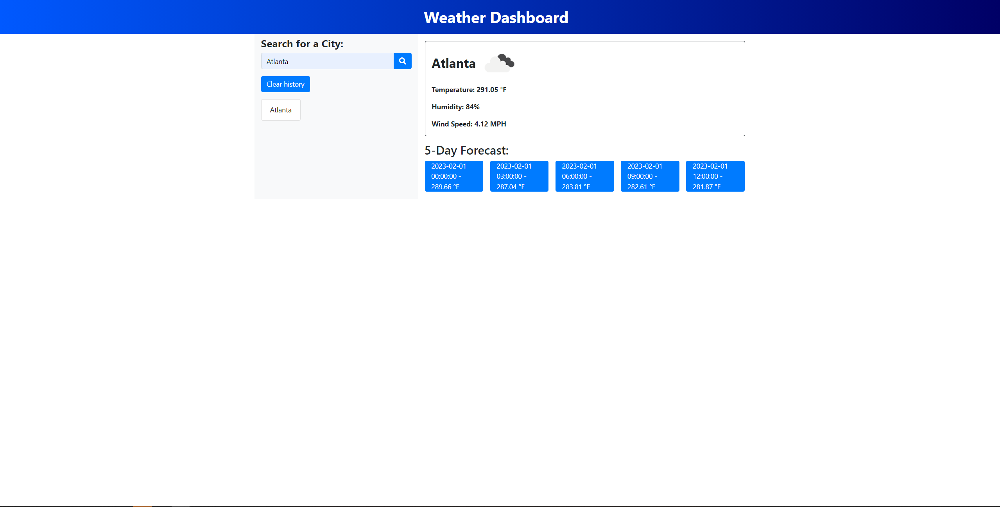

# Weather-Dashboard

You simply type in the search box what city you would like to see the weather forcast for and then it will take you to the 5 day forcast for that specific area.

## Acceptance Criteria

```
GIVEN a weather dashboard with form inputs
WHEN I search for a city
THEN I am presented with current and future conditions for that city and that city is added to the search history
WHEN I view current weather conditions for that city
THEN I am presented with the city name, the date, an icon representation of weather conditions, the temperature, the humidity, and the wind speed
WHEN I view future weather conditions for that city
THEN I am presented with a 5-day forecast that displays the date, an icon representation of weather conditions, the temperature, the wind speed, and the humidity
WHEN I click on a city in the search history
THEN I am again presented with current and future conditions for that city
```

## Screenshots/Links

[Github Repo](https://github.com/NickFierke/Weather-Dashboard-6)\
[Live URL](https://nickfierke.github.io/Weather-Dashboard-6/)
